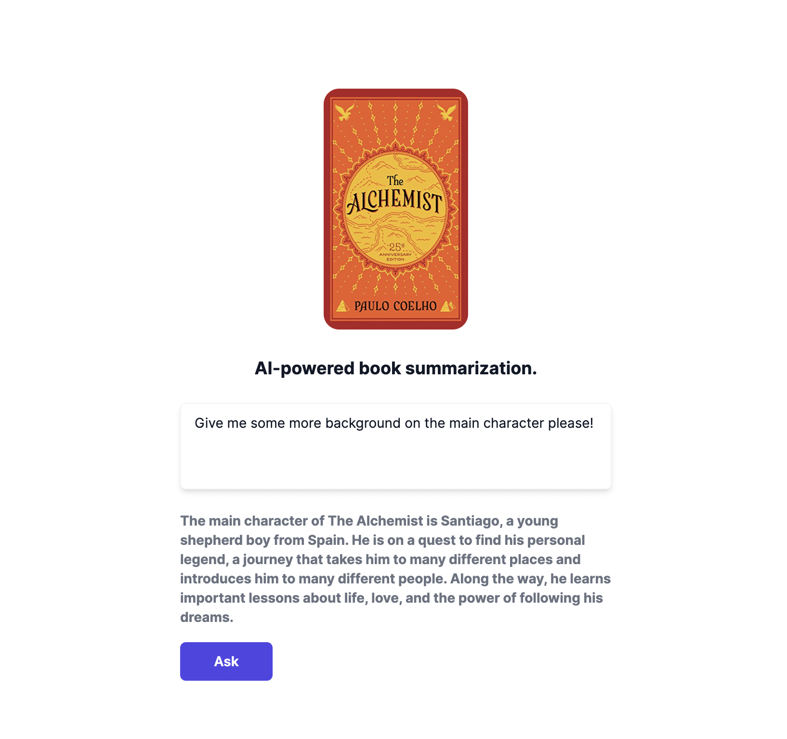

# Summary.ai

Basic text classification using OpenAI.

Test it [here](http://summary.ai.s3-website.us-east-2.amazonaws.com/).

This is inspired by: https://askmybook.com/question/614.

All credit is due to Sahil Lavingia.

## NOTE:

I'm pretty sure this is illegal. I do not own the rights to this book. This is just an example project and not intended to be used for copy or resale.

## Process

This is a test project to get familiar with RoR, and OpenAI integrations.

The premise of this web app is to create gp2 tokens from alchemist book, create embeddings based on the pdf text via OpenAI, and cache them for later use.

The process of this is as follows:

1. Rake task [found here](./api/lib/tasks/load.rake). This loads the pdf from disk and creates embeddings. Once it has the embeddings, it caches them in separate CSV's to be used at runtime.
2. Once rails is started, we initialize the file data in memory via [initializer](./api/config/initializers/load_embeds.rb).
3. An API is started and listens on port 3k. This receives traffic to a health endpoint so our Paperspace deployment can keep track of instances.
4. For every request that comes in, I hash the question and store in redis. Embeddings for the questions are cached by md5.
5. If a new question comes in and there is no cache, I fetch embeddings for the question, compare the embeddings to the csv embeds that were created during the rake task, do some *VERY* basic vector similarity comparison, and then create a classification request via OpenAI.
6. The above answer is cached based on the question, and the answer is sent back to the UI to display.

## Tradeoffs

1. I decided to use Redis for caching since Rails has cache support nicely built in. Just needed a small redis instance and I was good to go. I ended up deploying a small instance on [Render](https://render.com/).

2. I used Redis for ease since this project is a simple POC. I would consider using a relational database to store embeds, questions, etc if this was beyond a proof project.

3. There is no auth, TLS on the nginx (frontend). The API has a TLS cert that is provided by Paperspace. Once again, I did this for sake of brevity. In a real world 

4. Caching has basically useless in this scenario. I'm just proving a point that *some* persistence can be used with OpenAI.

5. I attempted to use Resembles API for voice, but it was giving me trouble. It's also incredibly slow. You can see comments in the questions controller about that.

## Deployment

The UI uses a NextJS static dump and makes calls to a Rails API.

The static files are hosted on S3 and the Rails api is hosted on [Paperspace](https://www.paperspace.com/gradient/deployments).

The reason I chose S3 was because I'm lazy, and I chose Paperspace Deployments because I'm the lead developer on the product and I wanted to flex what I've been working on for a bit.

You can look at the [Paperspace Config](.paperspace/config.yaml) to learn more about how this works. 

This API runs on an Nvidia P6000. :)

The entire app is backed by a CD process that runs in GitHub Actions. You can view my workflow [here](.github/workflows/main.yml).

## Follow up

The following improvements could be made:

1. Add better API response / validations.
2. Secure the API behind some limits / auth.
3. TLS the UI.
4. Improve caching.

## Final Notes

I have never deployed Ruby to production before, so this was a bit more time consuming than normal. I also had to teach myself a lot of the basic syntax for doing the embedding stuff. Please bear with me as I'm sure there are way better ways to do things in Rails world, and in general. :)

